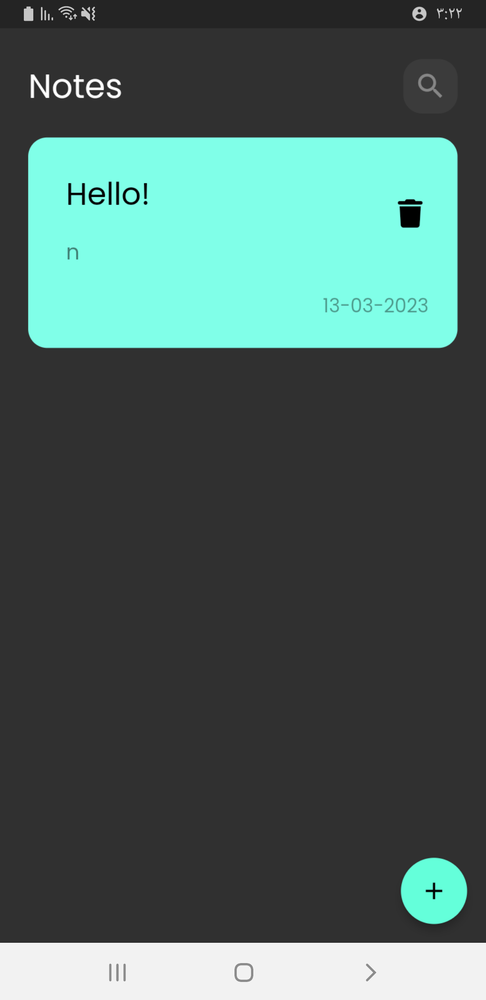

<h3>Notepad using Flutter ✏️🤩</h3>
<h5>The first application I built with State Management <a href="https://pub.dev/packages/flutter_bloc">Bloc<a/>, and you can take my code and learn and you will like it</h5>
 
  
 

  

    
  

  

    
  

  

    
  

/* Three image containers (use 25% for four, and 50% for two, etc) */
.column {
  float: left;
  width: 33.33%;
  padding: 5px;
}

/* Clear floats after image containers */
.row::after {
  content: "";
  clear: both;
  display: table;
}

